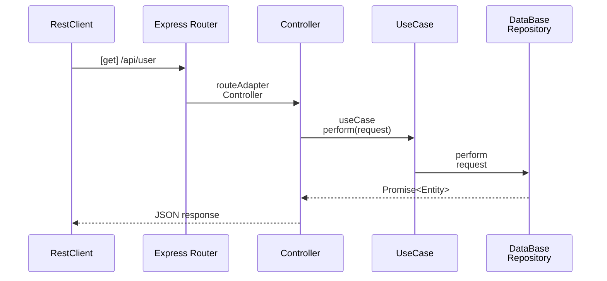

# Simple CRUD back-end APP

I created this app in order to demonstrate the Clean Architecture / SOLID principles (from my point of view) using the following dependencies:

- [Typescript](http://npmjs.com/typescript)
- [Mikro-ORM](http://npmjs.com/mikro-orm)
- [dotenv](http://npmjs.com/dotenv)
- [Express](http://npmjs.com/express)
- [JWT](https://www.npmjs.com/jsonwebtoken) (on next release)
- [CORS](https://www.npmjs.com/cors)
- [Docker](https://www.docker.com/)
- [Postgress](https://www.postgresql.org)

# Folder Structure

```
┣ src/
┃ ┣ app/
┃ ┃ ┣ controller/
┃ ┃ ┃ ┣ activity/
┃ ┃ ┃ ┣ user/
┃ ┃ ┃ ┣ controller.ts
┃ ┃ ┃ ┗ genericController.ts
┃ ┃ ┗ util/
┃ ┃   ┣ httpHelper.ts
┃ ┃   ┗ httpResponse.ts
┃ ┣ db/
┃ ┃ ┣ dbRepository.ts
┃ ┃ ┗ pgRepository.ts
┃ ┣ domain/
┃ ┃ ┣ entities/
┃ ┃ ┃ ┣ abstractBaseEntity.ts
┃ ┃ ┃ ┣ activity.ts
┃ ┃ ┃ ┣ index.ts
┃ ┃ ┃ ┗ user.ts
┃ ┃ ┗ usecases/
┃ ┃   ┣ createUseCase.ts
┃ ┃   ┣ deleteUseCase.ts
┃ ┃   ┣ getUseCase.ts
┃ ┃   ┣ index.ts
┃ ┃   ┣ updateUseCase.ts
┃ ┃   ┣ usecase.ts
┃ ┃   ┗ viewUseCase.ts
┃ ┣ main/
┃ ┃ ┣ adapters/
┃ ┃ ┃ ┗ routeAdapter.ts
┃ ┃ ┣ config/
┃ ┃ ┃ ┣ mikro-orm.pg.ts
┃ ┃ ┃ ┣ moduleAlias.ts
┃ ┃ ┃ ┣ orm-config.ts
┃ ┃ ┃ ┗ setupRoutes.ts
┃ ┃ ┣ factories/
┃ ┃ ┃ ┣ controller/
┃ ┃ ┃ ┣ db/
┃ ┃ ┃ ┗ useCases/
┃ ┃ ┗ routes/
┃ ┃   ┣ activityRoute.ts
┃ ┃   ┗ userRoute.ts
┃ ┗ server.ts
┣ .env
┣ .gitignore
┣ docker-compose.yml
┣ package-lock.json
┣ package.json
┣ README.md
┗ tsconfig.json
```

## Usage

> 1. **git clone https://github.com/thomascouto/backend-crud-app.git**
> 2. **docker-compose up -d (adjust docker yml file on your needs if you want)**
>    3.0 Local Use: npx mikro-orm migration:create --initial
>    3.1 Heroku Use: After deployment run the following: heroku run "npx mikro-orm schema:create -r --fk-checks" (I could not make 3.0 work on heroku because of session_replication_role variable).
> 3. **npm run dev** (local dev mode)

# Available routes / entities

### Activities entity:

> /api/activity (get)
> /api/activity/update/:id (put)

```json
{
  //update request
  "name": "My activity",
  "userid": "35"
}
```

> /api/activity/delete/:id (delete)
> /api/activity/create (post)

```json
{
  // create request
  "name": "My activity",
  "userid": "35"
}
```

---

> /api/activity/view

### Users entity

> /api/user
> /api/user/update/:id
> /api/user/delete/:id
> /api/user/create

```json
{
  "username": "username",
  "password": "password"
}
```

## UML diagrams

#### This is the basic sequence flow (I'm not a UML expert at all...)



## Next releases

The next planned release will be the front-end app consuming this api using React.
